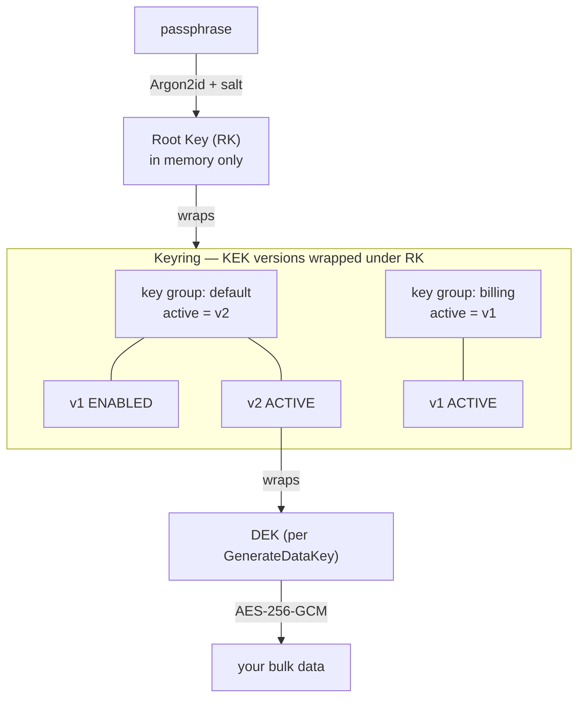
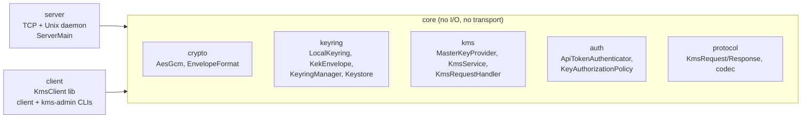
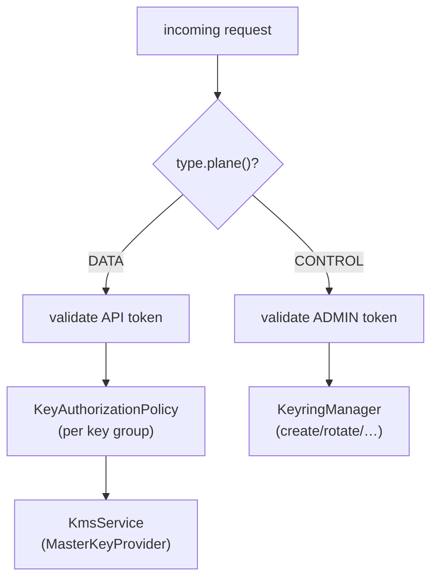
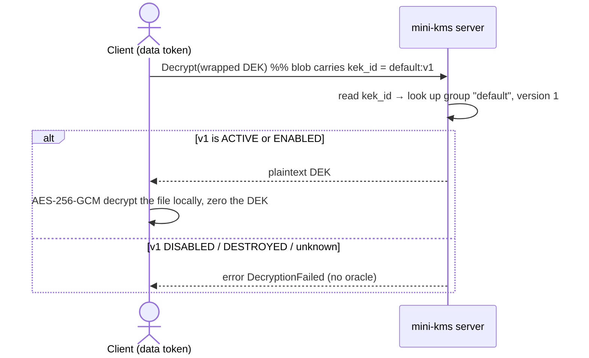
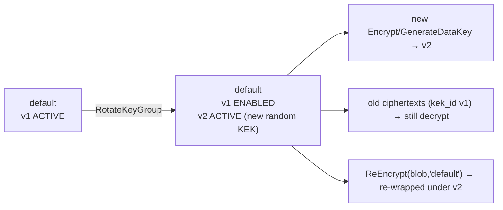
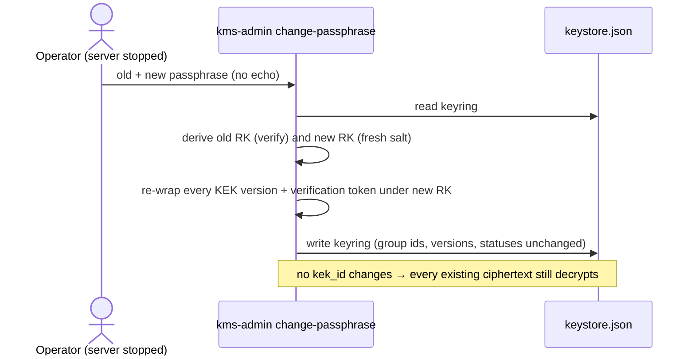

# mini-kms

A small, single-machine **Key Management Service** in Java that provides
**envelope encryption** with **rotatable keys** to local services over sockets.

mini-kms is intentionally small and heavily commented so you can **read it to
learn how a KMS actually works** — how a master/root key is derived and guarded,
how envelope encryption protects bulk data, how a **keyring of rotatable keys**
is modeled (named key groups with versions, just like AWS/GCP KMS), how a
**data plane** and **control plane** are separated, and where the seams are for
evolving toward a real, remote KMS.

> ⚠️ **Educational project.** It uses real, sound cryptographic constructions
> (Argon2id, AES-256-GCM, AEAD), but it has not been audited and is not a
> substitute for a production KMS (AWS KMS, GCP KMS, HashiCorp Vault, an HSM).

---

## Table of contents

- [What it does](#what-it-does)
- [The key hierarchy](#the-key-hierarchy)
- [Architecture](#architecture)
- [Data plane vs control plane](#data-plane-vs-control-plane)
- [How the main flows work (diagrams)](#how-the-main-flows-work-diagrams)
  - [GenerateDataKey + envelope-encrypt a file](#generatedatakey--envelope-encrypt-a-file)
  - [Decrypt — including after rotation](#decrypt--including-after-rotation)
  - [KEK rotation](#kek-rotation)
  - [Root / passphrase rotation (offline)](#root--passphrase-rotation-offline)
- [Ciphertext & keystore formats](#ciphertext--keystore-formats)
- [Transport & protocol](#transport--protocol)
- [Authentication & authorization](#authentication--authorization)
- [Building](#building)
- [Running the server](#running-the-server)
- [Using the CLIs](#using-the-clis)
- [Configuration reference](#configuration-reference)
- [Argon2 parameters](#argon2-parameters)
- [The `MasterKeyProvider` seam (remote KMS evolution)](#the-masterkeyprovider-seam-remote-kms-evolution)
- [Security notes](#security-notes)
- [Testing](#testing)

---

## What it does

mini-kms exposes an AWS-KMS-style API over local sockets:

**Data plane** (per-request crypto):
- **GenerateDataKey** — mint a random 256-bit *data encryption key* (DEK),
  returned **both** plaintext and **wrapped** under a key group's active key.
- **Encrypt** / **Decrypt** — protect/recover a small blob directly.
- **ReEncrypt** — re-wrap a blob onto a (possibly different) key group's active
  version, server-side, without exposing the plaintext. The companion to rotation.
- **Health** / **Ping**.

**Control plane** (key management):
- **CreateKeyGroup / RotateKeyGroup / ListKeyGroups**
- **DisableVersion / EnableVersion / DestroyVersion**
- **change-passphrase** (offline root-key rotation)

---

## The key hierarchy

The crucial idea — and what makes rotation safe — is a layered hierarchy of
keys. Only the passphrase is supplied by a human; **nothing below is ever stored
in plaintext.**



- **Root key (RK):** derived from the passphrase via **Argon2id** with a
  per-install salt. Re-derived on every boot; never stored.
- **Key group:** a named, addressable key (think AWS *KeyId* / GCP *CryptoKey*).
  Clients can use the `default` group or their own (e.g. `billing`), giving
  per-tenant isolation and independent rotation.
- **KEK version:** one rotation of a group's key material (AWS *key material
  version* / GCP *CryptoKeyVersion*). Each version is a random 256-bit key
  **wrapped under the root key** and stored in the keyring. Exactly one version
  per group is `ACTIVE` (used for new encryption); older ones stay `ENABLED`
  (decrypt only).
- **DEK:** a per-operation data key wrapped under a group's active KEK version.

Because every ciphertext records the exact `(group, version)` that wrapped it
(its **`kek_id`**), rotating a group never strands old data.

---

## Architecture

A three-module Gradle build under base package `com.codeheadsystems.minikms`:



| Module   | Responsibility | Depends on |
|----------|----------------|------------|
| `core`   | Crypto, the keyring (root key + key groups + versions), the `MasterKeyProvider`/`KeyringManager` seams, KMS ops + request handling, auth/authz, JSON protocol. | — |
| `server` | The socket daemon (loopback TCP + Unix socket), framing, virtual-thread concurrency, `main`. | `core` |
| `client` | The `KmsClient` library, the **data-plane** `client` CLI, and the **control-plane** `kms-admin` CLI. | `core` |

`core` has no socket/transport/CLI code. The request handler lives in `core`, so
the master-key/keyring implementation can be swapped with no server change.

---

## Data plane vs control plane

The two planes are explicit throughout the code (separate interfaces, separate
tokens, a `plane()` tag on every request type):



- **Data plane** — `GenerateDataKey`, `Encrypt`, `Decrypt`, `ReEncrypt`,
  `Health`. Authenticated by the **API token**; each key-group access passes
  through a `KeyAuthorizationPolicy`.
- **Control plane** — `Create/Rotate/List/Disable/Enable/DestroyVersion`.
  Authenticated by a **separate admin token**.
- **Root/passphrase rotation** is offline-only (the `kms-admin change-passphrase`
  command operates on the keystore file and never sends a passphrase over a socket).

---

## How the main flows work (diagrams)

### GenerateDataKey + envelope-encrypt a file

```mermaid
sequenceDiagram
    actor App as Client (data token)
    participant KMS as mini-kms server
    Note over App,KMS: bulk data is encrypted locally; only the tiny DEK is wrapped
    App->>KMS: GenerateDataKey(keyId="default", aad)
    KMS->>KMS: random DEK; wrap under default's ACTIVE version
    KMS-->>App: plaintext DEK + wrapped DEK (kek_id = default:v2)
    App->>App: AES-256-GCM encrypt file with plaintext DEK
    App->>App: write [ wrapped DEK | ciphertext ]  then zero the DEK
```

### Decrypt — including after rotation

The stored blob names its `kek_id`, so decryption selects the right version even
if the group was rotated since.



### KEK rotation



`RotateKeyGroup` mints a new random KEK version, makes it active, and demotes the
old version to `ENABLED`. Migrate old data forward at your leisure with
`ReEncrypt` (plaintext never leaves the server).

### Root / passphrase rotation (offline)



---

## Ciphertext & keystore formats

### Client-facing ciphertext (carries the `kek_id`)

```
 +---------+-------------+----------------+-----------+---------------------------+
 | version | groupIdLen  | groupId        | kekVer    | inner AES-GCM envelope    |
 | 0x02    | 1 byte (N)  | N bytes (UTF-8)| 8 bytes BE| (see below)               |
 +---------+-------------+----------------+-----------+---------------------------+
```

The **inner AES-GCM envelope** is the self-describing crypto primitive output,
used both here and (without a `kek_id`) for root-wrapped keyring entries:

```
 +---------+---------+------------------+-------------------------------+
 | version | alg id  | nonce (12 bytes) | ciphertext + GCM tag (16 B)   |
 | 0x01    | 0x01    |                  | (variable)                    |
 +---------+---------+------------------+-------------------------------+
   0x01 = AES-256-GCM, 96-bit nonce (fresh per op), 128-bit tag
```

### Keystore metadata file (`keystore.json`, `0600`)

Holds everything to *reconstruct* the root key (KDF + Argon2 params + salt), a
**verification token** (a constant encrypted under the root key, for fail-fast
wrong-passphrase detection), and the keyring: each group's versions with status
and KEK material **wrapped under the root key**. No plaintext key is ever stored.

### File envelope container (written by the CLI, `MKE1`)

```
 +--------+------------------+-------------------+----------------------+
 | "MKE1" | wrapped DEK len  | wrapped DEK       | file ciphertext      |
 | 4 B    | 4 bytes (int BE) | (len bytes)       | (inner AES-GCM env.)  |
 +--------+------------------+-------------------+----------------------+
```

---

## Transport & protocol

The server binds **both** a loopback-only TCP socket (`127.0.0.1`, configurable
port) and a **Unix domain socket** (`0600`, in a `0700` dir, via Java 21's native
`StandardProtocolFamily.UNIX`). Each connection runs on its own **virtual
thread**. Framing is **newline-delimited JSON** (one object per line); binary
fields are base64; each request line is bounded (default **1 MiB**).

### Request fields

| Field        | Type   | Used by | Notes |
|--------------|--------|---------|-------|
| `type`       | string | all     | see operations below; `Ping` aliases `Health` |
| `token`      | string | all     | API token (data) or admin token (control); never logged |
| `keyId`      | string | data target group / control subject group | omit on data ops → `default` |
| `version`    | number | `Disable/Enable/DestroyVersion` | the KEK version |
| `plaintext`  | string | `Encrypt` | base64 |
| `ciphertext` | string | `Decrypt`, `ReEncrypt` (source) | base64 |
| `aad`        | string | optional (crypto ops) | base64 encryption context |

### Response fields

| Field              | Present on            | Notes |
|--------------------|-----------------------|-------|
| `status`           | all                   | `ok` \| `error` |
| `errorCode`,`message` | errors             | codes below |
| `plaintextDataKey`,`wrappedDataKey` | `GenerateDataKey` | base64 |
| `ciphertext`       | `Encrypt`, `ReEncrypt`| base64 |
| `plaintext`        | `Decrypt`             | base64 |
| `detail`           | `Health`, version ops | text |
| `keyGroup`         | `Create/RotateKeyGroup` | `{keyId, activeVersion, versions[]}` |
| `keyGroups`        | `ListKeyGroups`       | array of the above |

**Error codes:** `AuthFailed`, `Unauthorized`, `InvalidRequest`,
`DecryptionFailed`, `FrameTooLarge`, `InternalError`. Any AEAD/keyring failure
(wrong key, wrong AAD, tampering, disabled/destroyed/unknown version) is flattened
to `DecryptionFailed` to avoid an oracle.

### Wire examples

```jsonc
// → GenerateDataKey under a group
{"type":"GenerateDataKey","token":"<api>","keyId":"billing","aad":"ZmlsZQ=="}
// ← ok
{"status":"ok","plaintextDataKey":"…","wrappedDataKey":"…"}

// → RotateKeyGroup (control plane: admin token)
{"type":"RotateKeyGroup","token":"<admin>","keyId":"default"}
// ← ok
{"status":"ok","keyGroup":{"keyId":"default","activeVersion":2,
  "versions":[{"version":1,"status":"ENABLED","createdAtEpochSec":1700000000},
              {"version":2,"status":"ACTIVE","createdAtEpochSec":1700000100}]}}

// → control op with the data token
{"type":"ListKeyGroups","token":"<api>"}
// ← error
{"status":"error","errorCode":"AuthFailed","message":"invalid admin token"}
```

---

## Authentication & authorization

- **Two shared tokens**, each loaded at startup from an env var or a file (never
  hardcoded, never a CLI arg): the **API token** (`MINIKMS_API_TOKEN`) guards the
  data plane; the **admin token** (`MINIKMS_ADMIN_TOKEN`) guards the control
  plane. Compared in **constant time**; applied to both sockets.
- **Authorization seam:** every data-plane key-group access passes through a
  `KeyAuthorizationPolicy`. The shipped default (`AllowAllPolicy`) lets any
  authenticated client use any group — groups still provide isolation and
  independent rotation. This is the explicit hook for "**KEK groups dependent on
  the client**": introduce per-client tokens later (mapping each to a distinct
  `Principal`) and supply a restrictive policy here — with **no change** to the
  request-handling code that already calls it.

---

## Building

Requires a JDK 21+ on `PATH` (the toolchain is pinned to 21).

```bash
./gradlew build                                     # compile + all tests
./gradlew :server:installDist :client:installDist   # runnable launcher scripts
```

Launchers:
- `server/build/install/server/bin/server`
- `client/build/install/client/bin/client`   (data plane)
- `client/build/install/client/bin/kms-admin` (control plane)

---

## Running the server

The server reads the passphrase **without echoing** (`Console.readPassword`),
with a `MINIKMS_PASSPHRASE` fallback for automation. First run initializes the
keystore (with a `default` key group); later runs validate the passphrase
(fail fast, exit `2`, on mismatch).

```bash
export MINIKMS_API_TOKEN="$(openssl rand -hex 32)"
export MINIKMS_ADMIN_TOKEN="$(openssl rand -hex 32)"
server/build/install/server/bin/server \
  --tcp-port 9123 \
  --unix-socket /run/user/$UID/mini-kms.sock \
  --keystore   ~/.mini-kms/keystore.json
# Keystore passphrase: ********   (typed, not echoed)
```

Stop with `Ctrl-C`; the shutdown hook zeros the root key and every KEK.

---

## Using the CLIs

### Data plane — `client` (uses `MINIKMS_API_TOKEN`)

```bash
export MINIKMS_API_TOKEN="…"
C=client/build/install/client/bin/client

$C --tcp 127.0.0.1:9123 health
$C --tcp 127.0.0.1:9123 generate-data-key --key billing --aad "ctx"
$C --tcp 127.0.0.1:9123 encrypt --text "hunter2" --out s.bin           # small blob
$C --tcp 127.0.0.1:9123 decrypt --in s.bin

# Real end-to-end envelope encryption of a file:
$C --tcp 127.0.0.1:9123 encrypt-file --in report.pdf --out report.mke --key billing --aad "report.pdf"
$C --unix /run/user/$UID/mini-kms.sock decrypt-file --in report.mke --out report.out --aad "report.pdf"

# Migrate a blob to another group's active version (server-side):
$C --tcp 127.0.0.1:9123 reencrypt --in report.mke --out report.archived.mke --key archive
```

### Control plane — `kms-admin` (uses `MINIKMS_ADMIN_TOKEN`)

```bash
export MINIKMS_ADMIN_TOKEN="…"
A=client/build/install/client/bin/kms-admin

$A --tcp 127.0.0.1:9123 list-keys
$A --tcp 127.0.0.1:9123 create-key      --key billing
$A --tcp 127.0.0.1:9123 rotate-key      --key default
$A --tcp 127.0.0.1:9123 disable-version --key default --version 1
$A --tcp 127.0.0.1:9123 enable-version  --key default --version 1
$A --tcp 127.0.0.1:9123 destroy-version --key default --version 1   # irreversible

# Offline root/passphrase rotation (run with the server stopped):
$A change-passphrase --keystore ~/.mini-kms/keystore.json
# Current passphrase: ********   New passphrase: ********
```

---

## Configuration reference

| Flag | Env var | Default | Meaning |
|------|---------|---------|---------|
| `--tcp-port N` | `MINIKMS_TCP_PORT` | `9123` | loopback TCP port (`0` = ephemeral) |
| `--unix-socket PATH` | `MINIKMS_UNIX_SOCKET` | `<data>/kms.sock` | Unix socket path |
| `--keystore PATH` | `MINIKMS_KEYSTORE` | `<data>/keystore.json` | keystore metadata file |
| `--token-file PATH` | `MINIKMS_API_TOKEN_FILE` | — | file holding the API token |
| `--admin-token-file PATH` | `MINIKMS_ADMIN_TOKEN_FILE` | — | file holding the admin token |
| `--max-frame-bytes N` | `MINIKMS_MAX_FRAME_BYTES` | `1048576` | per-request size limit |
| `--no-tcp` / `--no-unix` | — | — | disable a listener |
| (secret) | `MINIKMS_API_TOKEN` | — | data-plane token value (preferred over file) |
| (secret) | `MINIKMS_ADMIN_TOKEN` | — | control-plane token value (preferred over file) |
| (secret) | `MINIKMS_PASSPHRASE` | — | passphrase fallback when no TTY |

`<data>` is `$XDG_DATA_HOME/mini-kms` if set, else `~/.mini-kms`. Flags override
env vars override defaults.

---

## Argon2 parameters

Defaults (persisted per-install so they can be raised later without breaking
existing keystores):

| Parameter | Default | Why |
|-----------|---------|-----|
| memory | **64 MiB** | dominant cost; raises brute-force price |
| iterations | **3** | passes over memory |
| parallelism | **1** | lanes |

Comfortably above OWASP's Argon2id floor (19 MiB, t=2, p=1) while deriving in
well under a second. Tests use tiny parameters for speed.

---

## The `MasterKeyProvider` seam (remote KMS evolution)

The request handler depends only on two interfaces:

- **`MasterKeyProvider`** (data plane): `wrap/unwrap/encrypt/decrypt/keyIdOf`.
- **`KeyringManager`** (control plane): `create/rotate/list/disable/enable/destroy`.

`LocalKeyring` implements both for this single-machine version. Because the
`kek_id` is carried *inside* the opaque blob, the data-plane signatures are
stable. A future **`RemoteMasterKeyProvider`** delegating `wrap`/`unwrap` (and
key management) to AWS KMS, Vault, or an HSM can drop in — the master key would
then never exist on this machine — **without changing the server's request
handling**.

---

## Security notes

- **No secrets in logs** — tokens, passphrases, keys, and bodies are never logged.
- **Loopback + Unix only**, Unix socket `0600` in a `0700` dir; tokens still
  required on both (defense in depth).
- **Two-token plane separation** so data clients can't manage keys and vice versa.
- **Constant-time token checks**; **authenticated encryption** everywhere;
  **bounded frames**.
- **Rotation never strands data** (kek_id), and **destroy is intentionally
  irreversible** (crypto-shredding).
- **Not audited.** Don't protect real production secrets with this.

---

## Testing

```bash
./gradlew test
```

Coverage includes: Argon2 derivation + salt persistence, wrong-passphrase
detection, AES-GCM round-trips, tamper/AAD-mismatch detection, the envelope and
`kek_id` formats, DEK wrap/unwrap, **key-group create/rotate/disable/enable/
destroy**, **decrypt-after-rotation**, **group isolation**, **ReEncrypt
migration**, **offline passphrase rotation preserving all ciphertexts**, the
keystore never containing plaintext keys, the JSON protocol, constant-time auth,
the **data/admin token separation**, the **authorization policy**, and a full
**integration test** that boots the server on an ephemeral loopback port and a
temp Unix socket and drives both planes through the real client over both
transports.

CI runs `./gradlew build` on every push and pull request via
[`.github/workflows/build.yml`](.github/workflows/build.yml).
